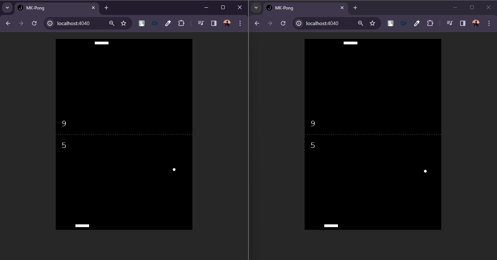

# Multiplayer Ping Pong Game

This repository contains a simple multiplayer ping pong game built using Socket.IO and Express.js. Players can connect to the game and compete against each other in real-time.

## Features

- Real-time multiplayer gameplay using Socket.IO
- Simple and intuitive controls
- Score tracking for each player

## Technologies Used

- Node.js
- Express.js
- Socket.IO
- HTML5 Canvas for rendering the game
- CSS for styling

## Setup Instructions

1. Clone the repository:

2. Install dependencies:

   - npm install

3. Start the server:

   - npm run dev

4. Open your browser and navigate to `http://localhost:4040` to play the game.

## How to Play

- Use the mouse to control the paddle.
- Hit the ball with your paddle to keep it in play.
- Try to score points by making the ball pass your opponent's paddle.
- The player with the highest score wins the game.

## Contributing

Contributions are welcome! If you have any ideas, bug fixes, or enhancements, feel free to open an issue or submit a pull request.